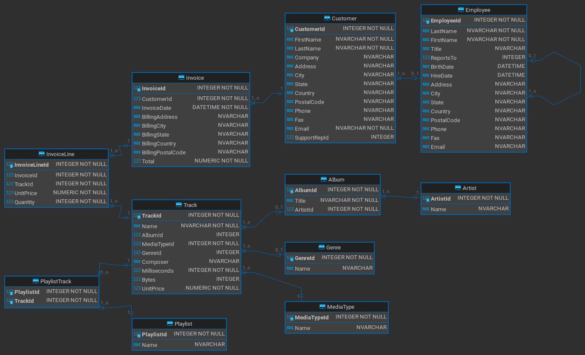
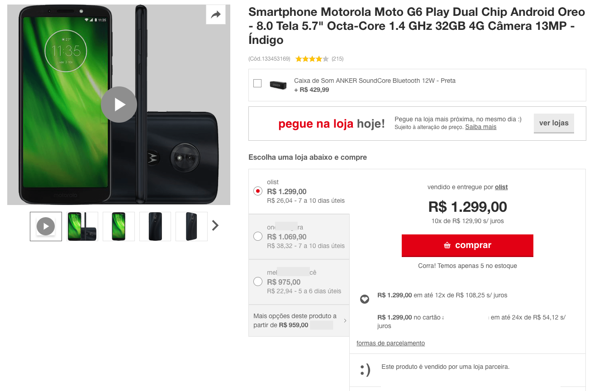
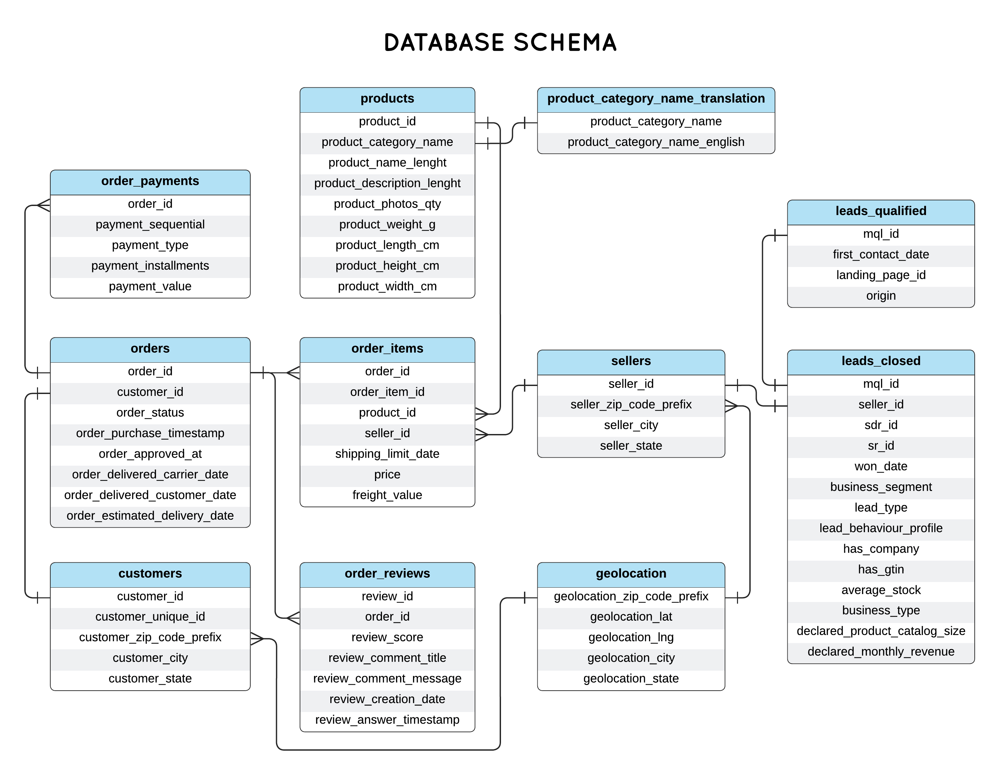

# Wide World Importers
https://learn.microsoft.com/en-in/sql/samples/wide-world-importers-what-is?view=sql-server-ver16

## Overview 

This is an overview of the fictitious company Wide World Importers and the workflows that are addressed in the WideWorldImporters sample databases for SQL Server and Azure SQL Database.

Wide World Importers (WWI) is a wholesale novelty goods importer and distributor operating from the San Francisco bay area.

As a wholesaler, WWI's customers are mostly companies who resell to individuals. WWI sells to retail customers across the United States including specialty stores, supermarkets, computing stores, tourist attraction shops, and some individuals. WWI also sells to other wholesalers via a network of agents who promote the products  on WWI's behalf. While all of WWI's customers are currently based in the United States, the company is intending to push for expansion into other countries/regions.

WWI buys goods from suppliers including novelty and toy manufacturers, and other novelty wholesalers. They stock the goods in their WWI warehouse and reorder from suppliers as needed to fulfill customer orders. They also purchase large volumes of packaging materials, and sell these in smaller quantities as a convenience for the customers.

Recently WWI started to sell a variety of edible novelties such as chilly chocolates. The company previously didn't have to handle chilled items. Now, to meet food handling requirements, they must monitor the temperature in their chiller room and any of their trucks that have chiller sections.

## Workflow for warehouse stock items

The typical flow for how items are stocked and distributed is as follows:

* WWI creates purchase orders and submits the orders to the suppliers.
* Suppliers send the items, WWI receives them and stocks them in their warehouse.
* Customers order items from WWI
* WWI fills the customer order with stock items in the warehouse, and when they don't have sufficient stock, they order the additional stock from the suppliers.
* Some customers don't want to wait for items that aren't in stock. If they order say five different stock items, and four are available, they want to receive the four items and backorder the remaining item. The item would then be sent later in a separate shipment.
* WWI invoices customers for the stock items, typically by converting the order to an invoice.
* Customers might order items that aren't in stock. These items are backordered.
* WWI delivers stock items to customers either via their own delivery vans, or via other couriers or freight methods.
* Customers pay invoices to WWI.
* Periodically, WWI pays suppliers for items that were on purchase orders. This is often sometime after they've received the goods.

## Additional workflows

These are additional workflows.

* WWI issues credit notes when a customer doesn't receive the good for some reason, or when the goods are faulty. These are treated as negative invoices.
* WWI periodically counts the on-hand quantities of stock items to ensure that the stock quantities shown as available on their system are accurate. (The process of doing this is called a stocktake).
* Cold room temperatures. Perishable goods are stored in refrigerated rooms. Sensor data from these rooms is ingested into the database for monitoring and analytics purposes.
* Vehicle location tracking. Vehicles that transport goods for WWI include sensors that track the location. This location is again ingested into the database for monitoring and further analytics.

## WideWorldImporters database catalog

The WideWorldImporters database contains all the transaction information and daily data for sales and purchases, as well as sensor data for vehicles and cold rooms.

## Schemas

WideWorldImporters uses schemas for different purposes, such as storing data, defining how users can access the data, and providing objects for data warehouse development and integration.

### Data schemas

These schemas contain the data. Many tables are needed by all other schemas and are located in the Application schema.

| Schema      | Description                                                                                                                             |
| ----------- | --------------------------------------------------------------------------------------------------------------------------------------- |
| Application | Application-wide users, contacts, and parameters. This schema also contains reference tables with data that is used by multiple schemas |
| Purchasing  | Stock item purchases from suppliers and details about suppliers.                                                                        |
| Sales       | Stock item sales to retail customers, and details about customers and sales people.                                                     |
| Warehouse   | Stock item inventory and transactions.                                                                                                  |

## Tables

All tables in the database are in the data schemas.

### Application Schema

Details of parameters and people (users and contacts), along with common reference tables (common to multiple other schemas).

| Table            | Description                                                                                                                                                                                                                                                                                                                                                  |
| ---------------- | ------------------------------------------------------------------------------------------------------------------------------------------------------------------------------------------------------------------------------------------------------------------------------------------------------------------------------------------------------------ |
| SystemParameters | Contains system-wide configurable parameters.                                                                                                                                                                                                                                                                                                                |
| People           | Contains user names, contact information, for all who use the application, and for the people that the Wide World Importers deals with at customer organizations. This table includes staff, customers, suppliers, and any other contacts. For people who have been granted permission to use the system or website, the information includes login details. |
| Cities           | There are many addresses stored in the system, for people, customer organization delivery addresses, pickup addresses at suppliers, etc. Whenever an address is stored, there is a reference to a city in this table. There is also a spatial location for each city.                                                                                        |
| StateProvinces   | Cities are part of states or provinces. This table has details of those, including spatial data describing the boundaries each state or province.                                                                                                                                                                                                            |
| Countries        | States or Provinces are part of countries/regions. This table has details of those, including spatial data describing the boundaries of each country/region.                                                                                                                                                                                                 |
| DeliveryMethods  | Choices for delivering stock items (for example, truck/van, post, pickup, courier, etc.)                                                                                                                                                                                                                                                                     |
| PaymentMethods   | Choices for making payments (for example, cash, check, EFT, etc.)                                                                                                                                                                                                                                                                                            |
| TransactionTypes | Types of customer, supplier, or stock transactions (for example, invoice, credit note, etc.)                                                                                                                                                                                                                                                                 |

### Purchasing Schema

Details of suppliers and of stock item purchases.

| Table                | Description                                                                        |
| -------------------- | ---------------------------------------------------------------------------------- |
| Suppliers            | Main entity table for suppliers (organizations)                                    |
| SupplierCategories   | Categories for suppliers (for example, novelties, toys, clothing, packaging, etc.) |
| SupplierTransactions | All financial transactions that are supplier-related (invoices, payments)          |
| PurchaseOrders       | Details of supplier purchase orders                                                |
| PurchaseOrderLines   | Detail lines from supplier purchase orders                                         |

 
### Sales Schema

Details of customers, salespeople, and of stock item sales.

| Table                | Description                                                                              |
| -------------------- | ---------------------------------------------------------------------------------------- |
| Customers            | Main entity tables for customers (organizations or individuals)                          |
| CustomerCategories   | Categories for customers (for example, novelty stores, supermarkets, etc.)               |
| BuyingGroups         | Customer organizations can be part of groups that exert greater buying power             |
| CustomerTransactions | All financial transactions that are customer-related (invoices, payments)                |
| SpecialDeals         | Special pricing. This can include fixed prices, discount in dollars or discount percent. |
| Orders               | Detail of customer orders                                                                |
| OrderLines           | Detail lines from customer orders                                                        |
| Invoices             | Details of customer invoices                                                             |
| InvoiceLines         | Detail lines from customer invoices                                                      |

### Warehouse Schema

Details of stock items, their holdings and transactions.

| Table                 | Description                                                                                |
| --------------------- | ------------------------------------------------------------------------------------------ |
| StockItems            | Main entity table for stock items                                                          |
| StockItemHoldings     | Non-temporal columns for stock items. These are frequently updated columns.                |
| StockGroups           | Groups for categorizing stock items (for example, novelties, toys, edible novelties, etc.) |
| StockItemStockGroups  | Which stock items are in which stock groups (many to many)                                 |
| Colors                | Stock items can (optionally) have colors                                                   |
| PackageTypes          | Ways that stock items can be packaged (for example, box, carton, pallet, kg, etc.          |
| StockItemTransactions | Transactions covering all movements of all stock items (receipt, sale, write-off)          |
| VehicleTemperatures   | Regularly recorded temperatures of vehicle chillers                                        |
| ColdRoomTemperatures  | Regularly recorded temperatures of cold room chillers                                      |

### Table design

- All tables have single column primary keys for join simplicity.
- All schemas, tables, columns, indexes, and check constraints have a Description extended property that can be used to identify the purpose of the object or column. Memory-optimized tables are an exception to this since they don't currently support extended properties.
- All foreign keys are automatically indexed unless there is another nonclustered index that has the same left-hand component.
- Auto-numbering in tables is based on sequences. These sequences are easier to work with across linked servers and similar environments than IDENTITY columns. Memory-optimized tables use IDENTITY columns since they don't support in SQL Server 2016.
- A single sequence (TransactionID) is used for these tables: CustomerTransactions, SupplierTransactions, and StockItemTransactions. This demonstrates how a set of tables can have a single sequence.
- Some columns have appropriate default values.

Based on the Wide World Importers (WWI) database schema and the workflow for warehouse stock items, here are some intermediate to advanced SQL query exercises to enhance your skills:

1. **Identifying Backordered Items**: Write a query to list all customer orders that include backordered items. For each order, display the order ID, customer name, order date, and the names of the backordered items.
2. **Supplier Performance Analysis**: Create a query to evaluate supplier performance by calculating the average delivery time for each supplier. Display the supplier name, total number of deliveries, and average delivery time in days.
3. **Stock Level Monitoring**: Develop a query to identify stock items that have fallen below their reorder level. For each item, show the stock item ID, name, current quantity on hand, and reorder level.
4. **Salesperson Contribution** Write a query to determine the total sales amount generated by each salesperson within the last fiscal year. Include the salesperson's name, total sales amount, and the percentage contribution to the overall sales.
5. **Customer Order Patterns**: Construct a query to find customers who have placed orders for the same stock item more than once in the past six months. List the customer name, stock item name, and the number of times the item was ordered.
6. **Inventory Turnover Rate**: Create a query to calculate the inventory turnover rate for each stock item over the past year. Display the stock item ID, name, total sales quantity, average stock level, and turnover rate.
7. **Monthly Sales Trends**: Write a query to analyze monthly sales trends by calculating the total sales amount for each month in the current year. Present the month, total sales amount, and the percentage change compared to the previous month.
8. **Order Fulfillment Efficiency**: Develop a query to assess order fulfillment efficiency by determining the average time taken to fulfill customer orders. Show the order ID, customer name, order date, fulfillment date, and the time taken in days.
9. **High-Value Customers** Construct a query to identify customers who have generated revenue exceeding a certain threshold in the past year. List the customer name, total revenue, and the number of orders placed.
10. **Product Category Sales Analysis**: Create a query to analyze sales performance by product category. For each category, display the category name, total sales amount, total quantity sold, and the average sales price per item.

# Airlines

Travel Database

Check out the `./airlines` folder.

[Schema Diagram PDF](./airlines/airlines.schema.dia.pdf)

[Schema Description PDF](./airlines/airlines.schema.desc.pdf)

# Chinook

The Chinook data model represents a digital media store, including tables for artists, albums, media tracks, invoices and customers.

Check out the `./chinook` folder.

---

# Olist
Ecommerce Database

https://www.kaggle.com/datasets/terencicp/e-commerce-dataset-by-olist-as-an-sqlite-database
https://www.kaggle.com/datasets/olistbr/brazilian-ecommerce
https://www.kaggle.com/datasets/olistbr/brazilian-ecommerce?select=olist_geolocation_dataset.csv

Brazilian E-Commerce Public Dataset by Olist
Welcome! This is a Brazilian ecommerce public dataset of orders made at Olist Store. The dataset has information of 100k orders from 2016 to 2018 made at multiple marketplaces in Brazil. Its features allows viewing an order from multiple dimensions: from order status, price, payment and freight performance to customer location, product attributes and finally reviews written by customers. We also released a geolocation dataset that relates Brazilian zip codes to lat/lng coordinates.

This is real commercial data, it has been anonymised, and references to the companies and partners in the review text have been replaced with the names of Game of Thrones great houses.

Join it With the Marketing Funnel by Olist
We have also released a Marketing Funnel Dataset. You may join both datasets and see an order from Marketing perspective now!

Instructions on joining are available on this Kernel.

## Context
This dataset was generously provided by Olist, the largest department store in Brazilian marketplaces. Olist connects small businesses from all over Brazil to channels without hassle and with a single contract. Those merchants are able to sell their products through the Olist Store and ship them directly to the customers using Olist logistics partners. See more on our website: www.olist.com

After a customer purchases the product from Olist Store a seller gets notified to fulfill that order. Once the customer receives the product, or the estimated delivery date is due, the customer gets a satisfaction survey by email where he can give a note for the purchase experience and write down some comments.

## Attention
An order might have multiple items.
Each item might be fulfilled by a distinct seller.
All text identifying stores and partners where replaced by the names of Game of Thrones great houses.
Example of a product listing on a marketplace

## Data Schema
The data is divided in multiple datasets for better understanding and organization. Please refer to the following data schema when working with it:

## Classified Dataset
We had previously released a classified dataset, but we removed it at Version 6. We intend to release it again as a new dataset with a new data schema. While we don't finish it, you may use the classified dataset available at the Version 5 or previous.

## Inspiration
Here are some inspiration for possible outcomes from this dataset.

### NLP:
This dataset offers a supreme environment to parse out the reviews text through its multiple dimensions.

### Clustering:
Some customers didn't write a review. But why are they happy or mad?

### Sales Prediction:
With purchase date information you'll be able to predict future sales.

### Delivery Performance:
You will also be able to work through delivery performance and find ways to optimize delivery times.

### Product Quality:
Enjoy yourself discovering the products categories that are more prone to customer insatisfaction.

### Feature Engineering:
Create features from this rich dataset or attach some external public information to it.

## Acknowledgements
Thanks to Olist for releasing this dataset.